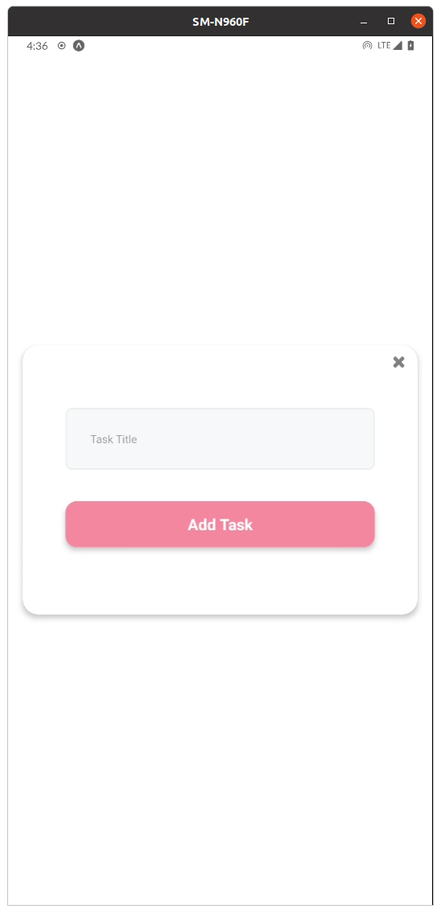

# Todo

Todo List app for React Native Screening Test offered by CabbageApps

## Deployment

To deploy this project run

```bash
  sudo npm install -g expo-cli
  expo install .
  npm install .
  expo start
```

## Building

Build the app with npm

```bash
expo build:android
expo build:ios
```

## Features

- Cross platform (Android/iOS)
- Add Task
- Mark Task as Done
- Delete a Task

## Screenshots

### Populated


### Empty


### New Task



## Acknowledgements

- This app was written in 5 hours and as so the codebase reflects internal conceptualization that is not heavily modularized or overly explained and/or complicated, I tried to Keep It Simple Stupid.
- No external libraries have been leveraged in an attempt to forgeo stability and consistent performance of the overall user experience.
- Many implementations within this project have been hastily designed so as to reach deadlines.

## Optimizations

[Leverages sharp image optimization library courtesy of expo.](https://docs.expo.io/distribution/optimizing-updates/)

```bash
sudo npm install -g sharp-cli
npx expo-optimize
```

## Lessons Learned

- Modularization & clean conceptualization is key.
- There is no need to import every library under the sun to achieve functionality, most functionality within this project was created in house with standard expo libs.

## Tech Stack

**Client:** React-Native

**Dev-Tools** VSCode/Emacs/GIT

## Support & Feedback

For support or feedback, please email diamondbond1@gmail.com.

## Authors

- [@diamondbond](https://github.com/diamondbond)

## Links

```html
title: Test Specification
link: https://www.notion.so/React-Native-Test-4be24184f6844d7c9d3eb16d5464d3b6

title: Mockup
link: https://dribbble.com/shots/12162589-Schedo-Task-Manager-App
```

## Tree

```sh
diamond@matebook:~/git/todo$ tree -I node_modules
.
├── app.json
├── App.tsx
├── assets
│   ├── fonts
│   │   └── SpaceMono-Regular.ttf
│   └── images
│       ├── adaptive-icon.png
│       ├── favicon.png
│       ├── icon.png
│       ├── splash.png
│       └── user.png
├── babel.config.js
├── components
│   ├── EditScreenInfo.tsx
│   ├── StyledText.tsx
│   ├── __tests__
│   │   └── StyledText-test.js
│   └── Themed.tsx
├── constants
│   ├── Colors.ts
│   └── Layout.ts
├── hooks
│   ├── useCachedResources.ts
│   └── useColorScheme.ts
├── navigation
│   ├── BottomTabNavigator.tsx
│   ├── index.tsx
│   └── LinkingConfiguration.ts
├── package.json
├── package-lock.json
├── README.md
├── screens
│   ├── NotFoundScreen.tsx
│   ├── TabOneScreen.tsx
│   └── TabTwoScreen.tsx
├── tsconfig.json
└── types.tsx

9 directories, 28 files
```
